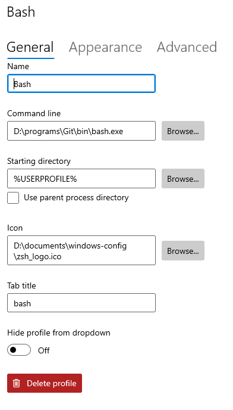
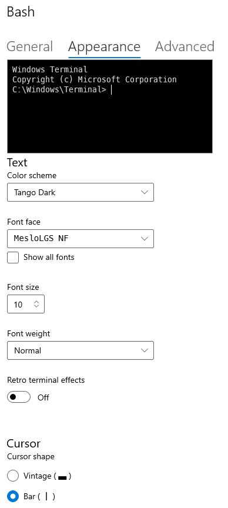

> # **Configurations**

## General [here](../general-config.md)
---

## Terminal on Windows

* Install _Windows Terminal_ on _Microsoft Store_
* Configure _Windows Terminal_ to run with _bash_ on _settings_
* Tango Dark theme
* MesloLGS NF font
* Font size 10px
* To stylize _Windows Terminal_ you need to install _oh-my-posh_ by _winget_
    * If you don't have _winget_ installed, download the _Windows Package Manager_ [here](https://github.com/microsoft/winget-cli/releases/)
        * Option `Microsoft.DesktopAppInstaller_*.msixbundle`
        * After that you should be able to run `winget` on `terminal`
    * _oh-my-posh_ documentation [here](https://ohmyposh.dev/docs)
        * `winget install JanDeDobbeleer.OhMyPosh`
        * Make sure you have theme downloaded on `~\AppData\Local\Programs\oh-my-posh\themes`
        * Paste this [.bashrc](.bashrc) file on `%USERPROFILE%`
            * Update path with the corresponding theme JSON file
* If you want, you can update terminal icon with the file below

---

### _Windows Terminal_ configuration sample

